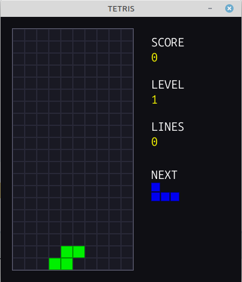
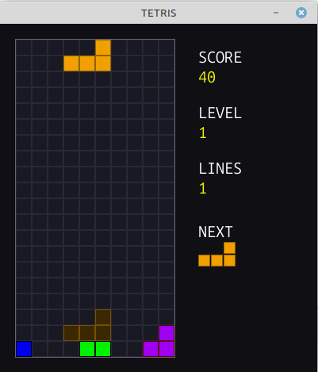
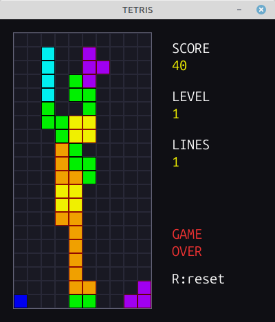

# Tetris in C

A complete Tetris clone written in C using SDL2, with no game engine or framework.

Built as a learning project focused on game programming fundamentals: game loop, collision detection, data-driven design, and clean separation between logic and rendering.


## Features

- All 7 tetrominos with original colors
- Movement, rotation and wall kick
- Automatic gravity with configurable speed
- Ghost piece showing where the piece will land
- Line clear with cascade
- Score system based on the original Nintendo Tetris (40 / 100 / 300 / 1200 × level)
- Level progression — speeds up every 10 lines cleared
- Next piece preview
- Background music (SDL2_mixer)
- Game over detection and restart

## Controls

| Key | Action |
|-----|--------|
| `←` `→` | Move left / right |
| `↓` | Soft drop |
| `↑` or `Z` | Rotate |
| `R` | Restart (after game over) |
| `ESC` | Quit |

## Dependencies

- GCC or Clang
- CMake 3.16+
- SDL2
- SDL2_ttf
- SDL2_mixer

### Installing on Linux (Debian/Ubuntu)

```bash
sudo apt install libsdl2-dev libsdl2-ttf-dev libsdl2-mixer-dev
```

### Installing on macOS

```bash
brew install sdl2 sdl2_ttf sdl2_mixer
```

### Installing on Windows

Download the development libraries from https://libsdl.org and point CMake to them.

## Building

```bash
mkdir build && cd build
cmake ..
cmake --build .
```

## Running

```bash
./build/tetris
```

## Project structure

```
.
├── assets/
│   └── tetris.mp3        # background music
├── src/
│   ├── main.c            # game loop, state, input, score, level
│   ├── grid.h / grid.c   # 10×20 playfield, line clear
│   ├── tetromino.h / tetromino.c  # pieces, movement, rotation, lock
│   ├── ui.h / ui.c       # text rendering (SDL2_ttf)
│   └── audio.h / audio.c # music playback (SDL2_mixer)
└── CMakeLists.txt
```

## Architecture

The project follows a clean separation between logic and rendering:

- **`GameState`** holds all mutable state: grid, current piece, next piece, score, level, lines cleared and gravity accumulator
- **`handle_events`** reads SDL input and dispatches to tetromino functions
- **`update`** advances the gravity timer and triggers lock/clear/spawn on each tick
- **`render`** draws grid, ghost piece, current piece and sidebar — reads state but never mutates it

Each subsystem lives in its own `.h`/`.c` pair. `main.c` is the only file that knows about all of them.

## Scoring

Based on the original Nintendo Tetris formula:

| Lines cleared | Points |
|---------------|--------|
| 1 | 40 × level |
| 2 | 100 × level |
| 3 | 300 × level |
| 4 (Tetris!) | 1200 × level |

## Screenshots

### Gameplay


### Scoring


### Game Over


## License

MIT